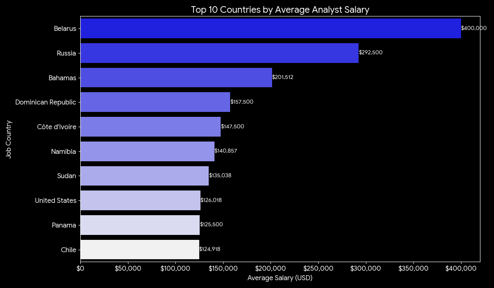
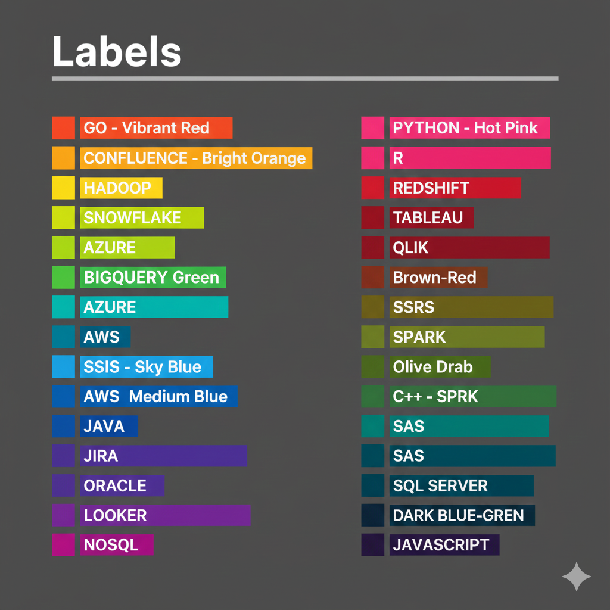

# 📊 Data Analyst Job Market Analysis


---

## TL;DR ⚡  
This project explores the **data analyst job market in 2023**, highlighting:  
- 💰 Top-paying roles and leadership positions  
- 🏢 Highest-paying companies and 🌍 countries  
- 📈 Most in-demand and highest-paying skills  
- 🚀 Insights to guide career planning and skill development  

---

## Introduction
Explore the world of data careers! This project examines **Data Analyst** roles—highlighting top-paying positions, the most in-demand skills, and where strong demand meets high salaries.  

🔎 **SQL Queries:** Find them here: [project_sql folder](/project_sql/)

---

## Background
The data industry is growing rapidly, with companies relying on analytics to drive decisions. Roles, required skills, and salaries vary widely.  

This project digs into job postings to identify:  
- Top-paying roles  
- Skills employers value most  
- Companies and countries offering the best opportunities  

---

## Five Key Questions ❓
1. What are the top-paying Data Analyst jobs?  
2. What skills are required for these top-paying jobs?  
3. Which skills are most in demand for data analysts?  
4. Which skills are associated with higher salaries?  
5. What are the most optimal skills to learn?

---

## Tools Used 🛠️
- **SQL** – Querying and analyzing the data  
- **PostgreSQL** – Database management  
- **Visual Studio Code** – Query execution and organization  
- **Git & GitHub** – Version control and sharing  

---

## Analysis Highlights 📊

### 1. Top-Paying Remote Data Analyst Jobs 💼
Identifies the highest-earning remote Data Analyst roles in 2023.
```sql
SELECT
    job_id,
    job_title,
    job_location,
    job_schedule_type,
    salary_year_avg,
    job_posted_date,
    name AS company_name
FROM job_postings_fact
LEFT JOIN company_dim USING (company_id)
WHERE job_title_short = 'Data Analyst'
    AND job_location = 'Anywhere'
    AND salary_year_avg IS NOT NULL
ORDER BY salary_year_avg DESC
LIMIT 10 
```


**Insights:**  
- 🏆 Leadership roles pay the most (e.g., Mantys – 650K USD)  
- 🔹 Specialized roles and remote flexibility increase earnings  
- 📊 Standard analyst roles cluster around moderate salaries (138K–165K USD)  

---

### 2. Skills Required for Top-Paying Roles 🧰
This section focuses on the skills required for the top-paying **Data Analyst** roles which helps to identify what employers value most in today’s job market.
```sql
WITH top_paying_jobs AS (
SELECT
    job_id,
    job_title,
    salary_year_avg,
    name AS company_name
FROM
    job_postings_fact
LEFT JOIN company_dim USING (company_id)
WHERE
    job_title_short = 'Data Analyst' AND
    job_location = 'Anywhere' AND
    salary_year_avg IS NOT NULL
ORDER BY
    salary_year_avg DESC
LIMIT 10
)
SELECT 
    top_paying_jobs.*,
    skills
FROM top_paying_jobs
INNER JOIN skills_job_dim USING (job_id)
INNER JOIN skills_dim USING (skill_id)
ORDER BY
    salary_year_avg DESC
```


**Insights:**  
- SQL and Excel remain foundational  
- Python, Tableau, and Power BI are essential for analysis and visualization  

---

### 3. Top 10 Companies by Average Salary 🏢
This analysis highlights the top 10 companies offering the highest salaries for data analyst roles, helping professionals quickly see where the best compensation opportunities lie and make informed career decisions.


```sql

WITH companies AS(
    SELECT 
    company_dim.name AS company_name,
    job_title,
    salary_year_avg AS avg_salary
FROM
    job_postings_fact
LEFT JOIN
    company_dim USING (company_id)
WHERE
    job_title_short = 'Data Analyst'
    AND salary_year_avg IS NOT NULL
ORDER BY
    salary_year_avg DESC
)
SELECT
    company_name,
    ROUND(AVG(avg_salary), 0) AS avg_salary
FROM
    companies
GROUP BY
    company_name
ORDER BY
    avg_salary DESC
LIMIT 10
```


**Insights:**  
- Mantys, ЛАНИТ, and Torc Robotics lead in pay  
- Specialized firms often outpace major tech companies in compensation  

---

### 4. Top 10 Countries by Average Salary 🌍
This analysis shows the top ten countries with the highest salaries for data analyst roles, giving a quick view of where compensation is most competitive globally.
```sql
SELECT
    job_country,
    ROUND (AVG(salary_year_avg), 0) AS avg_salary
FROM
    job_postings_fact
WHERE
    salary_year_avg IS NOT NULL AND
    job_country IS NOT NULL
GROUP BY
    job_country
ORDER BY
    avg_salary DESC

```


**Insights:**  
- Belarus, Russia, and the Bahamas top the salary chart  
- Developed markets (US, Canada, Australia) offer competitive and reliable pay  

---

### 5. Optimal Skills 💻
This analysis highlights the most in-demand and highest-paying technical skills in today’s job market. 
```sql
WITH skills_demand AS (
SELECT 
    skill_id,
    skills,
    COUNT(job_id) AS demand_count,
    ROUND(AVG(salary_year_avg), 0) as avg_salary
    FROM job_postings_fact
INNER JOIN skills_job_dim USING (job_id)
INNER JOIN skills_dim USING (skill_id)
WHERE job_title_short = 'Data Analyst' AND
    salary_year_avg IS NOT NULL AND
    job_work_from_home IS TRUE
GROUP BY skill_id,
         skills
)
SELECT
    skill_id,
    skills,
    demand_count,
    avg_salary
FROM
    skills_demand
WHERE
    demand_count>10
ORDER BY
        avg_salary DESC,
        demand_count DESC
LIMIT 25
```



**Insights:**  
- Python and Tableau dominate in demand  
- Cloud platforms and big data tools offer high pay  
- Niche skills like Go and Confluence yield top-tier salaries  

---

## Key Insights Table 📋

| Top Companies        | Avg Salary (USD) | Top Countries       | Avg Salary (USD) |
|---------------------|----------------|-------------------|----------------|
| Mantys              | 650,000        | Belarus           | 400,000        |
| ЛАНИТ                | 400,000        | Russia            | 292,500        |
| Torc Robotics       | 375,000        | Bahamas           | 201,512        |
| Illuminate Mission S.| 375,000       | Dominican Rep.    | 157,500        |
| Care.com            | 350,000        | Côte d'Ivoire     | 147,500        |

---

## Data Assumptions & Notes 📝
- Based on **2023 job postings**  
- Salaries reported in **USD**; no conversion applied  
- Only roles labeled **“Data Analyst”** with non-null salaries included  
- Outliers kept as-is for transparency  

---

## Closing Thought 💡
High pay in data analytics comes from the right mix of **role, company, and location**. Understanding these trends helps professionals strategically plan careers and focus on skills that drive the best opportunities.


